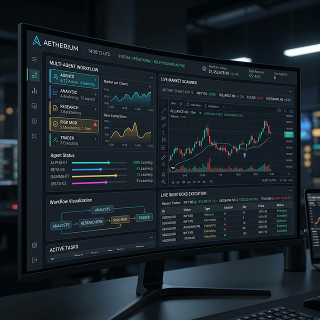
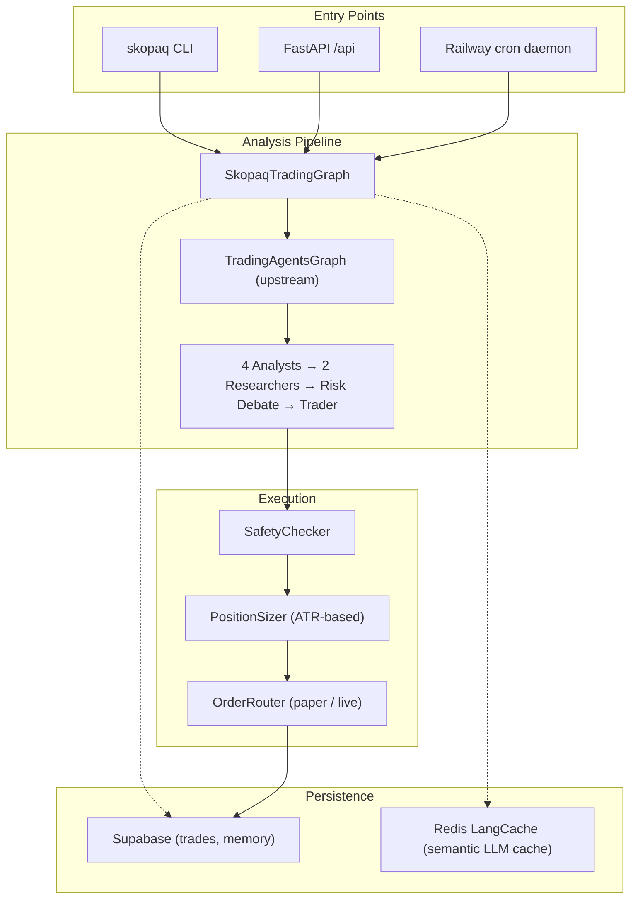

<div align="center">


# SkopaqTrader

**AI-powered algorithmic trading for Indian equities**

[](https://python.org)
[](https://langchain-ai.github.io/langgraph/)
[](tests/unit/)

</div>

> **Disclaimer:** This software is for educational and research purposes only. It is not financial advice. Trading involves substantial risk of loss. You are solely responsible for any trades executed using this software. Never risk capital you cannot afford to lose.

---

## What is this?

SkopaqTrader is a multi-agent AI system that analyzes Indian equities and executes trades through the INDstocks broker API. A team of specialized LLM agents — market analyst, news analyst, social sentiment analyst, fundamentals analyst — debates each trade before a risk manager assigns a confidence score and a trader agent makes the final call.

The system runs unattended on a daily cron job (09:10 IST, weekdays via Railway), scans the NIFTY 50 for opportunities, and manages positions through EOD.

**This is not a backtest-first quant system.** It's closer to a digital analyst desk that runs every morning, does its research, places a few high-conviction trades, and closes them out by 3:20 PM.

Built on [TradingAgents v0.2.0](https://github.com/TauricResearch/TradingAgents) (Apache 2.0) with a custom `skopaq/` layer on top.



---

## How it works

```
Morning cron (09:10 IST)
  → scanner screens NIFTY 50 with 3 LLMs in parallel
  → top candidates fed to multi-agent analysis pipeline
  → each agent adds a layer: technicals, news, sentiment, fundamentals
  → bull/bear researchers debate, risk manager scores confidence
  → trader agent decides BUY / SELL / HOLD
  → safety checker validates position limits and drawdown rules
  → order placed (paper or live via INDstocks)
  → position monitor watches until EOD — hard stop, AI exit, or 3:20 PM close
```

### Agent roles and models

| Agent | Model | Why |
|-------|-------|-----|
| Market Analyst | Gemini 3 Flash | Fast, cheap, good at structured data |
| News Analyst | Gemini 3 Flash | Needs tool-calling (Perplexity doesn't support it) |
| Social Analyst | Grok 3 Mini via OpenRouter | Twitter/X context |
| Fundamentals | Gemini 3 Flash | Cheap enough to run on every candidate |
| Bull/Bear Researchers | Gemini 3 Flash | Volume of output matters more than depth |
| Research Manager | Claude Opus 4.6 | Judge role — needs the strongest reasoning |
| Risk Manager | Claude Opus 4.6 | Same — confidence score determines position size |
| Trader | Gemini 3 Flash | Final decision after all debate is done |
| Sell Analyst | Gemini 3 Flash | Real-time exit decisions during monitoring |
| Scanner Screeners | Gemini + Grok + Perplexity | Parallel, each sees something different |

> Perplexity Sonar is scanner-only. It doesn't support tool calling, so it can't run as a LangGraph agent.

### Architecture overview



---

## Features

**Trading**
- Paper and live modes (INDstocks broker, NSE/BSE)
- Crypto support via Binance (spot + futures, with on-chain/DeFi/funding analysts)
- Autonomous daemon: full session from scan to close, runs unattended

**Risk management**
- ATR-based position sizing (stop distance determines lot size)
- Confidence-scaled positions (risk manager's score scales down uncertain trades)
- VIX/NIFTY SMA regime detection (reduces exposure in volatile markets)
- NSE event calendar — no new positions on RBI policy days, F&O expiry, election results
- Sector concentration limiter (max 40% in any one sector)
- Daily/weekly/monthly drawdown circuit breakers

**Intelligence**
- Post-trade reflection loop — agents review realized P&L and update memory
- BM25-indexed persistent memory in Supabase — lessons survive across sessions
- Semantic LLM cache via Redis LangCache — up to 45× speedup on repeated queries
- Multi-model tiering — cost-optimize by role (Gemini for volume, Claude for judgment)

**Monitoring**
- Three-tier position monitor: hard stop → AI sell analyst → EOD safety net
- Trailing stop support
- Min profit gate (blocks sells when net P&L < estimated brokerage cost)

---

## Installation

```bash
git clone <repo>
cd skopaqtrader

python -m venv .venv
source .venv/bin/activate

pip install -e ".[dev]"

cp .env.example .env
# Fill in API keys
```

Minimum viable setup: just `SKOPAQ_GOOGLE_API_KEY` for Gemini (all roles fall back to it).

For full tiering:
```env
SKOPAQ_GOOGLE_API_KEY=...       # Gemini 3 Flash — default for most roles
SKOPAQ_ANTHROPIC_API_KEY=...    # Claude Opus 4.6 — research + risk manager
SKOPAQ_OPENROUTER_API_KEY=...   # Grok (social) + Perplexity (scanner)
```

For live trading on NSE/BSE, set your INDstocks token:
```bash
skopaq token set <your-indstocks-token>
```

---

## Usage

```bash
# System health (checks all connections and token validity)
skopaq status

# Analyze a stock — runs the full agent pipeline, no execution
skopaq analyze RELIANCE
skopaq analyze TATAMOTORS --date 2026-02-28

# Analyze + execute (paper mode by default)
skopaq trade RELIANCE

# Live mode — requires explicit --live flag + confirmation prompt
skopaq trade RELIANCE --live

# Run scanner (screens NIFTY 50 with 3 LLMs)
skopaq scan
skopaq scan --max-candidates 10

# Autonomous session (full day: scan → analyze → trade → monitor → close)
skopaq daemon --once --paper           # Paper, run now
skopaq daemon --dry-run                # Scan only, print candidates, no trades
skopaq daemon --once --max-trades 1    # Live, 1 trade max

# Monitor open positions until EOD
skopaq monitor

# FastAPI backend
skopaq serve --port 8000

# Token management
skopaq token set <token>
skopaq token status
skopaq token clear
```

### Python API

```python
from skopaq.config import SkopaqConfig
from skopaq.graph.skopaq_graph import SkopaqTradingGraph
from skopaq.execution.executor import Executor

config = SkopaqConfig()
# (build executor — see skopaq/cli/main.py for the full setup)

graph = SkopaqTradingGraph(upstream_config, executor)

# Analysis only
result = await graph.analyze("RELIANCE", "2026-03-01")
print(result.signal)       # TradingSignal(action='BUY', confidence=72, ...)
print(result.raw_decision) # Full agent reasoning

# Analysis + execution
result = await graph.analyze_and_execute("RELIANCE", "2026-03-01")
print(result.execution)    # ExecutionResult(success=True, fill_price=2847.5, ...)
```

---

## Configuration

All config is in `skopaq/config.py` as a Pydantic Settings class (`env_prefix="SKOPAQ_"`). A `.env` file at the repo root is loaded automatically.

Key settings (see `.env.example` for the full list):

```env
# Trading mode
SKOPAQ_TRADING_MODE=paper          # paper | live
SKOPAQ_INITIAL_PAPER_CAPITAL=1000000

# Daemon limits
SKOPAQ_DAEMON_MAX_TRADES_PER_SESSION=3
SKOPAQ_DAEMON_MAX_CANDIDATES_TO_ANALYZE=5

# Risk
SKOPAQ_RISK_PER_TRADE_PCT=0.01     # 1% of capital per trade
SKOPAQ_ATR_MULTIPLIER=2.0          # Stop distance = 2× ATR
SKOPAQ_MIN_CONFIDENCE_PCT=0        # 0 = disabled; set to 40 to filter low-confidence signals

# Position monitor
SKOPAQ_MONITOR_HARD_STOP_PCT=0.04  # 4% hard stop
SKOPAQ_MONITOR_EOD_EXIT_MINUTES_BEFORE_CLOSE=10  # Sell at 15:20 IST

# LLM cache
SKOPAQ_LANGCACHE_ENABLED=false
SKOPAQ_LANGCACHE_THRESHOLD=0.90    # Cosine similarity for cache hit
```

---

## Safety model

Safety rules live in `skopaq/constants.py` as frozen dataclasses. They cannot be changed at runtime — no config flag, no environment variable, no monkey-patching.

```python
@dataclass(frozen=True)
class SafetyRules:
    max_position_pct: float = 0.15      # Max 15% of capital per position
    max_daily_loss_pct: float = 0.03    # Circuit breaker at 3% daily loss
    max_open_positions: int = 5
    max_order_value_inr: float = 500_000.0
    market_hours_only: bool = True
    # ...
```

The daemon runs under `DAEMON_SAFETY_RULES` — a tighter variant (3 positions, ₹2L cap, 5 orders/min) appropriate for unattended operation.

Live trading has a double confirmation gate: the `trade` and `daemon` commands both require explicit `--live` flag + an interactive confirmation prompt before sending any real order.

---

## Testing

```bash
# Unit tests — 466 tests, fast, no API keys needed
python -m pytest tests/unit/ -x -q

# Specific module
python -m pytest tests/unit/execution/ -v

# Integration tests (requires .env with real keys)
python -m pytest tests/integration/ -v -m integration

# Coverage
python -m pytest tests/unit/ --cov=skopaq --cov-report=term-missing
```

---

## Project structure

```
skopaqtrader/
├── skopaq/                    # Core extensions
│   ├── agents/                # Sell analyst (AI exit decisions)
│   ├── api/                   # FastAPI backend
│   ├── blockchain/            # Gas oracle, whale alerts (crypto)
│   ├── broker/                # INDstocks + Binance + paper engine
│   ├── cli/                   # Typer CLI + Rich display
│   ├── db/                    # Supabase client + repositories
│   ├── execution/             # Safety → sizer → router + daemon + monitor
│   ├── graph/                 # SkopaqTradingGraph wrapper
│   ├── llm/                   # Multi-model tiering, env bridge, Redis cache
│   ├── memory/                # BM25-indexed agent memory
│   ├── risk/                  # ATR, regime, drawdown, calendar, concentration
│   ├── scanner/               # Parallel multi-model NIFTY 50 screener
│   ├── config.py              # SkopaqConfig (pydantic-settings)
│   └── constants.py           # Immutable SafetyRules
│
├── tradingagents/             # Vendored upstream (TradingAgents v0.2.0)
│   ├── agents/                # Analyst, researcher, trader, risk agents
│   ├── graph/                 # LangGraph orchestration
│   ├── dataflows/             # Data vendors (yfinance, INDstocks, crypto)
│   └── llm_clients/           # LLM factory
│
├── frontend/                  # Next.js dashboard (Vercel)
├── supabase/                  # DB migrations
├── docker/                    # Dockerfile (Railway)
├── tests/                     # Unit + integration tests
│
├── ARCHITECTURE.md            # System design and tradeoffs
├── DEVLOG.md                  # Development log
├── UPSTREAM_CHANGES.md        # All 34 modifications to vendored code
├── pyproject.toml
├── railway.toml               # FastAPI server (always-on)
└── railway-daemon.toml        # Daemon cron (09:10 IST weekdays)
```

---

## Deployment

| Service | Config | Purpose |
|---------|--------|---------|
| Railway (API) | `railway.toml` | FastAPI backend, always on |
| Railway (Daemon) | `railway-daemon.toml` | Cron at 09:10 IST weekdays |
| Vercel | `frontend/` | Next.js dashboard |
| Supabase | `supabase/` | PostgreSQL + auth + agent memory |
| Upstash | — | Redis for semantic LLM cache |
| Cloudflare Tunnel | — | Static IP for INDstocks API whitelist |

> **Warning:** Deploying the daemon to Railway means real orders will execute without human supervision. Start with paper mode. Monitor logs daily. The daemon respects SIGTERM — Railway's graceful shutdown signal — by stopping new positions and letting the monitor close existing ones.

See `docker/Dockerfile` for the shared container image.

---

## Upstream modifications

All 34 changes to `tradingagents/` are documented in [`UPSTREAM_CHANGES.md`](UPSTREAM_CHANGES.md).

The philosophy: treat upstream as a black box. SkopaqTrader calls `propagate()` and wraps the result. Modifications to upstream were limited to:
- Adding `llm_map` pass-through so per-role models can be injected
- Registering the INDstocks data vendor
- Adding parallel analyst execution (state reducers)
- Adding 7 crypto-specific analyst agents
- Confidence score extraction from the risk manager output
- A handful of bug fixes (yfinance suffix handling, indicator string parsing)

---

## Citation

Built on the TradingAgents framework:

```bibtex
@misc{xiao2025tradingagents,
  title={TradingAgents: Multi-Agents LLM Financial Trading Framework},
  author={Yijia Xiao and Edward Sun and Di Luo and Wei Wang},
  year={2025},
  eprint={2412.20138},
  archivePrefix={arXiv},
  url={https://arxiv.org/abs/2412.20138}
}
```

---

<div align="center">
<sub>Educational and research use only. Not financial advice. See disclaimer above.</sub>
</div>
